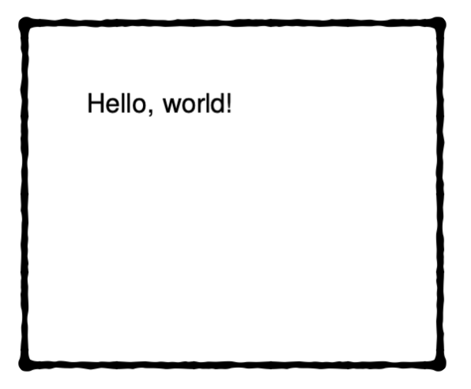

# Hello, world

!!! note "hello world"
    If you want to try the “Hello World” example yourself, you can simply call `xts new helloworld`. This creates a directory with the two necessary files. So you can start immediately and create a PDF in this directory with the xts command.


```xml title="data.xml"
<data name="user"></data>
```

```xml title="layout.xml"
<Layout xmlns="urn:speedata.de/2021/xts/en"
    xmlns:sd="urn:speedata.de/2021/xtsfunctions/en">

    <Record element="data">
        <PlaceObject>
            <Textblock>
                <Paragraph>
                    <Value select="concat('Hello, ', @name, '!')" />
                </Paragraph>
            </Textblock>
        </PlaceObject>
    </Record>
</Layout>
```

I will explain the code further below.

Now when you switch to your terminal or command and run `xts`, you should get a PDF file with the “Hello world!” text.

{: style="height:150px;"}

This is our first document, and it is very friendly, isn't it?

