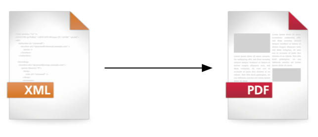

# About XTS


XTS is software for creating PDF files fully automatically from XML data. The data can be product data, structured texts or other content, for example.

{: style="height:150px;"}


The instructions on how something is to be displayed are available separately from the data. They are formulated in a programming language specially developed for this purpose.

## What is it all for?

Many different documents can be created with XTS. Classical use cases are

* Product catalogues
* Travel guides
* Price lists
* Data sheets

and many other documents, where it is important to obtain a result that is reproducible, fast and reliable and also “beautiful”.

## Beautiful and fully automatic

XTS is a non-interactive publishing software. This means there is no graphical user interface (GUI). All instructions must be established before the publishing process and determine how the data is arranged in the PDF. The unique combination of sophisticated algorithms and programmability allows extremely flexible layouts to be created that were previously reserved for interactive desktop publishing (DTP) programs such as Adobe’s InDesign.

## Where can I get the software and how is it run?

The software can be downloaded for free (see chapter Installation) and is started via the console or shell. The command to start XTS is called xts. Therewith, all functionality can be used. Parameters can be specified via the command line or a configuration file.

```
$ xts
```

See the command line section for explanations on how to start XTS.

## Examples

There is a separate repository with examples on  [Github](https://github.com/speedata/xts-examples). There you can find complete documents, which you can use to try out different functionality.


