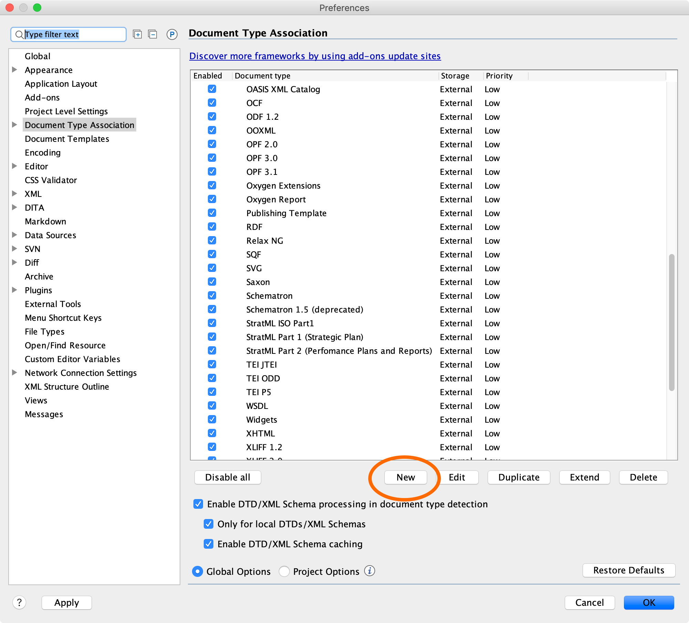
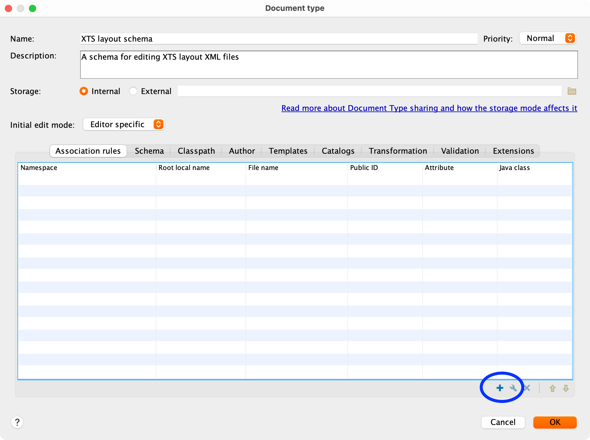
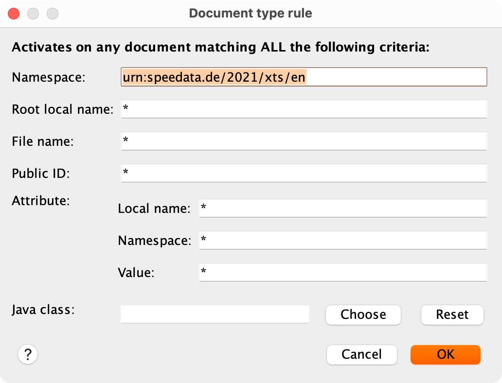
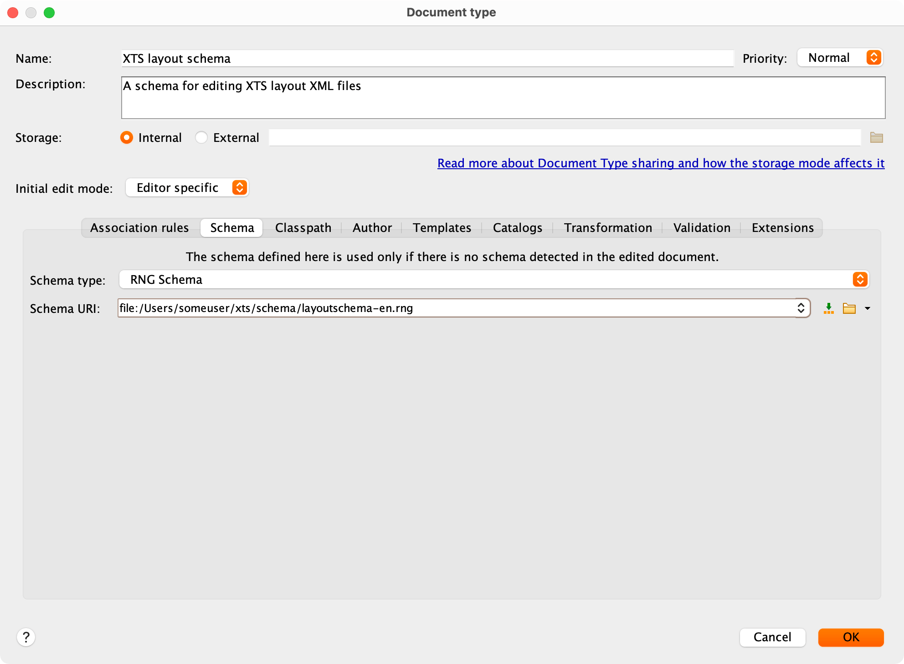
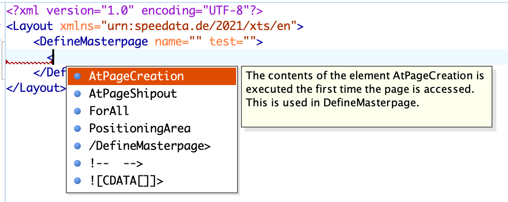
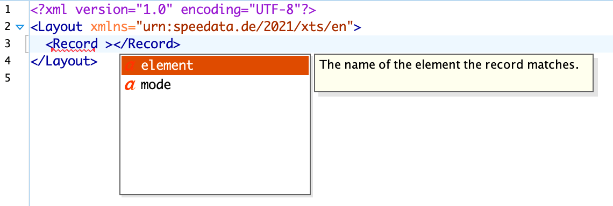

# oXygenXML

The editor [oXygen XML](https://www.oxygenxml.com) is a special XML editor that provides excellent support for editing the layout XML. To get this editor help, the schema must be assigned to the XTS layout namespace (`urn:speedata.de/2021/xts/en`).

In the settings you select the assignment of the document types (Document Type Association). Then click on “New” to create a new association

{: style="width: 70%" :}

In the first tab you have to click on the '+' to create an assignment.

{: style="width: 70%" :}

In this window you enter the namespace of the layout (`urn:speedata.de/2021/xts/en`).

{: style="width: 50%" :}

Now you can set RELAX NG and select the scheme.

{: style="width: 70%" :}

In the ZIP file it is located under share/schema/layoutschema-en.rng or …​-de.rng, depending on the desired language for the short description.

From now on, for every layout in the namespace

~~~
xmlns="urn:speedata.de/2021/xts/en"
~~~

the schema should be associated with the layout. This can be checked by the fact that a selection of commands now appears when you enter an opening angle bracket (`<`).

{: style="width: 50%" :}

If the scheme is correctly integrated, a selection list appears as soon as a command is entered. The same holds for the available attributes:

{: style="width: 50%" :}
