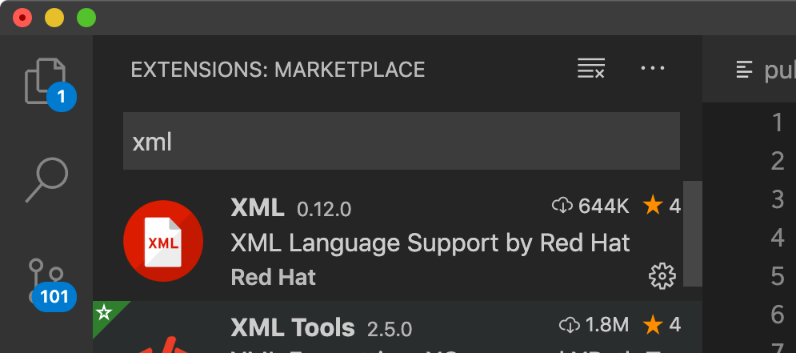
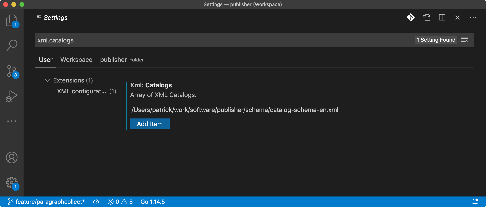
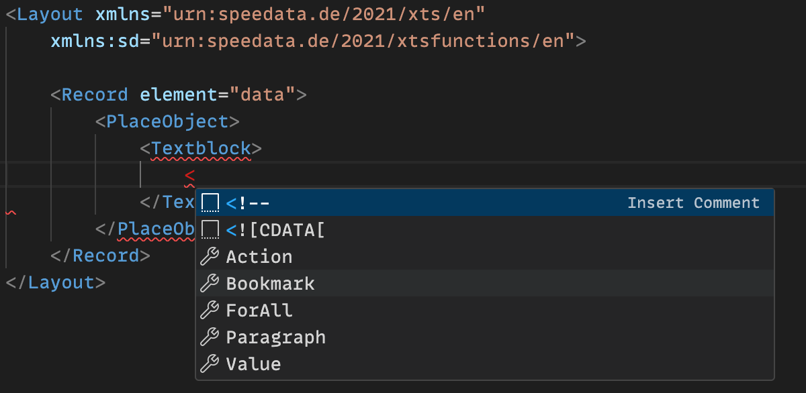

# XML and Visual Studio Code

The free (and open source) text editor [Visual Studio Code](https://code.visualstudio.com) (short: VS Code) can be used for many programming languages thanks to numerous extensions. To use the XTS layout schema, the XML extension from Red Hat is required:

Open the extensions marketplace and search for xml.
The extension from Red Hat is the right one.

This extension is controlled via so-called XML catalogues.
In these catalogs an association of namespace to a schema is created. Two ready-made catalogs are supplied with the speedata Publisher which link the speedata namespace with the corresponding schema files. In this way, you only have to include the catalog:

In the settings the variable xml.catalogs can be changed.
This must be set to catalog-schema-en.xml or catalog-schema-en.xml.
Of course the path must be adjusted.

There are two different schema files, each documented in two languages. For the English documentation `catalog-schema-en.xml` must be used, for the German documentation `catalog-schema-de.xml`.

If everything worked out fine, a layout with the namespace `urn:speedata.de/2021/xts/en` will get the auto-complete with description:

