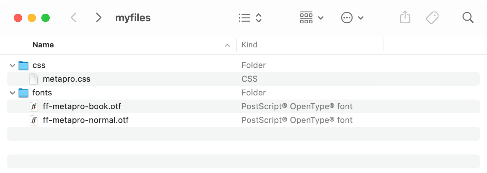
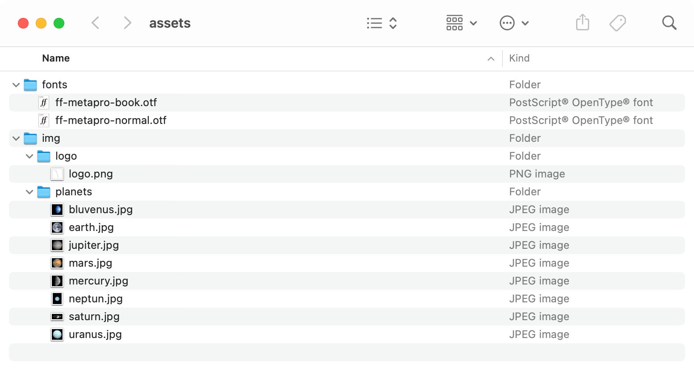

# File organization

This section describes how the necessary files (layout, data, images and font files) must be organized, where they are stored, what they must be called, and so on.

These are the rules for accessing resources:

1. File names must be given with relative or absolute paths
1. Resources can be accessed via URLs
1. Paths are always relative to the current working directory
1. ... except for CSS files: these paths are relative to the current CSS file
1. You can add local folders / directories to a lookup dictionary. File names given without a path are searched for in this dictionary.

## Accessing resources via relative or absolute paths

Both of these examples are identical, if the current working directory is `/Users/myuser/xts/playground`

~~~xml
<PlaceObject>
    <Image href="img/ocean.pdf" width="2"/>
</PlaceObject>
<PlaceObject>
    <Image href="/Users/myuser/xts/playground/img/ocean.pdf" width="2"/>
</PlaceObject>
~~~

## Using URLs for accessing resources

Just use the URL to the resource, no special handling is needed. Currently, no caching is being performed when downloading the files.

~~~xml
<PlaceObject>
    <Image href="https://placekitten.com/200/300" width="2"/>
</PlaceObject>
~~~

## Relative paths

As stated above, the file names are always relative to the current working directory, except for CSS file names.

{: style="border: 1px solid gray" :}

For example to load the `metapro.css` file, use

~~~xml
<Stylesheet href="css/metapro.css" />
~~~

the `metapro.css` file contains these lines:

~~~css
@font-face {
    font-family: "MetaPro";
    src: url("../fonts/ff-metapro-book.otf");
    font-weight: bold;
}

@font-face {
    font-family: "MetaPro";
    src: url("../fonts/ff-metapro-normal.otf");
}
~~~

Where the urls are relative to the css directory.

## Adding local lookups

You can add folder and the respective sub folders to a lookup dictionary.
Once these folder entries are read, you can access the resources with the file name, without path.

~~~
sp --extradir = /path/to/assets
~~~

{: style="border: 1px solid gray" :}

Now you can load the images with

~~~xml
<PlaceObject>
    <Image href="logo.png" />
</PlaceObject>
~~~

or

~~~xml
<PlaceObject>
    <Image href="jupiter.jpg" />
</PlaceObject>
~~~

The path is not relevant anymore if it is included in the lookup dictionary.

