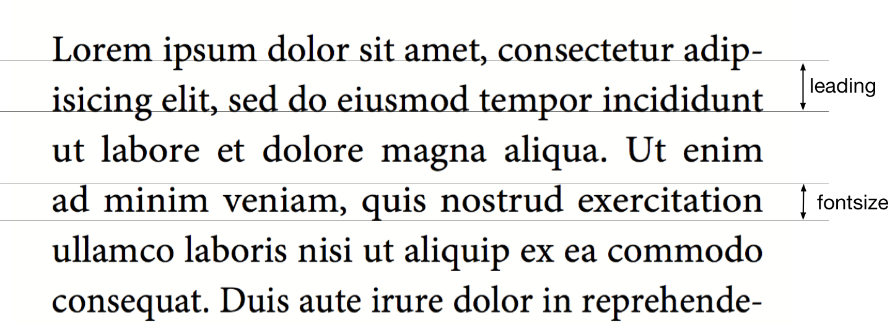
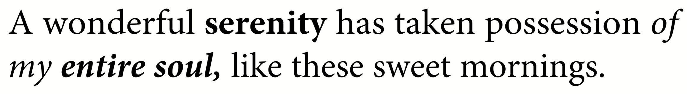
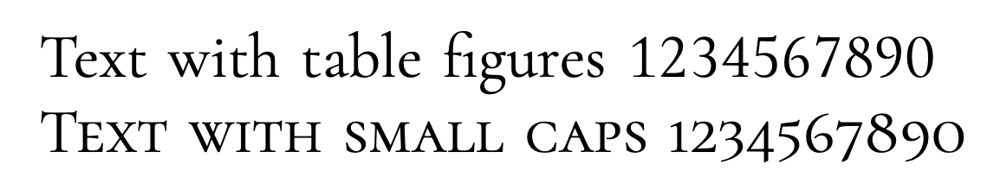
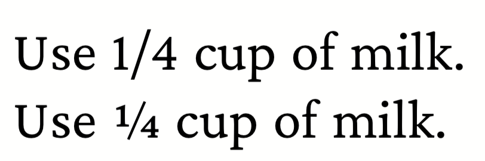

# Using fonts

Embedding fonts in the common formats is very easy. The formats Type1 (files .pfb and .afm) as well as TrueType and OpenType (files .ttf and .otf) are supported.

## Loading fonts

To make fonts known and used by XTS, two steps are necessary. The first step is to load a font family:

~~~xml
<Stylesheet>
  @font-face {
        font-family: "Minion Pro";
        src: url("MinionPro-Regular.otf");
  }

  @font-face {
      font-family: "Minion Pro";
      src: url("MinionPro-Bold.otf");
      font-weight: bold;
  }
  @font-face {
      font-family: "Minion Pro";
      src: url("MinionPro-BoldIt.otf");
      font-weight: bold;
      font-style: italic;
  }
  @font-face {
      font-family: "Minion Pro";
      src: url("MinionPro-It.otf");
      font-style: italic;
  }
</Stylesheet>
~~~

This defines a font family with the name “Minion Pro” (including the space) with four different font files.

The last three fonts (bold, italic and bold italic) do not have to be specified if they are not used in the layout.

<figure markdown>
  { width="100%" }
  <figcaption>Font size and line height</figcaption>
</figure>

## Selecting fonts

The font can now be used by setting a style in a stylesheet:

~~~xml
<Stylesheet>
  body {
    font-family: serif;
  }
  .preface {
    font-family: sans;
  }
</Stylesheet>

<Paragraph>
    
      <Value>Preface</Value>
    
  <Value> more text</Value>
</Paragraph>
~~~

## Text markup in the layout file

There are several ways to switch to the fonts bold, italic and bold-italic. The most direct one is to switch with the commands `<B>` and `<I>`, these can also be nested within each other:

~~~xml
<PlaceObject>
  <Textblock fontfamily="textfont">
    <Paragraph>
      <Value>A wonderful </Value>
      <B><Value>serenity</Value></B>
      <Value> has taken possession </Value>
      <I><Value>of my</Value>
        <Value> </Value>
        <B><Value>entire soul,</Value></B>
      </I>
      <Value> like these sweet mornings.</Value>
    </Paragraph>
  </Textblock>
</PlaceObject>
~~~

<figure markdown>
  { width="100%" }
  <figcaption>Text markup in layout. Underline (not shown) is possible with the command <code>&lt;U></code></figcaption>
</figure>

## Text markup in the layout file using HTML

You can use HTML markup directly within `<Value>`:

~~~xml
<PlaceObject>
  <Textblock>
    <Paragraph>
      <Value>A wonderful <b>serenity</b>
          has taken possession
          <i>of my <b>entire soul,</b></i>
          like these sweet mornings.
      </Value>
    </Paragraph>
  </Textblock>
</PlaceObject>
~~~

## Text markup in the data

If there are markups in the data (e.g. as HTML tags), then this works in principle in exactly the same way:

~~~xml
<PlaceObject>
  <Textblock fontfamily="textfont">
    <Paragraph>
      <Value select="."/>
    </Paragraph>
  </Textblock>
</PlaceObject>
~~~

with the corresponding data:

~~~xml
<data>A wonderful <b>serenity</b> has taken possession
  <i>of my <b>entire soul,</b></i> like these sweet
  mornings.</data>
~~~

The result is the same as above. The tags can also be written in capital letters in the data: `<B>` instead of `<b>`. Nesting is also allowed and again `<u>` is underlined.

TIP: If the data is not in well-formed XML but in HTML format for example, you can use the layout function `sd:decode-html()` to interpret it.

## OpenType Features

The OpenType format knows so-called OpenType features, such as old style figures or small caps.

~~~xml
<Layout xmlns="urn:speedata.de/2021/xts/en"
    xmlns:sd="urn:speedata.de/2021/xtsfunctions/en">

    <Stylesheet>
        p {
            font-family: serif;
        }
        .regular {
            font-feature-settings: "lnum","tnum" ;
        }
        .smcp {
            font-feature-settings: "smcp" ;
        }
    </Stylesheet>

    <Record element="data">
        <PlaceObject>
            <Textblock>
                <Paragraph class="regular">
                    <Value>Text with table figures 1234567890</Value>
                </Paragraph>
                <Paragraph class="smcp">
                    <Value>Text with small caps 1234567890</Value>
                </Paragraph>
            </Textblock>
        </PlaceObject>
    </Record>
</Layout>
~~~

<figure markdown>
  { width="100%" }
  <figcaption>Table figures (above) have the same width and are often used in tabular typesetting. Real small caps (below) differ significantly from mathematically reduced capital letters. The line width and proportions must be adjusted. Depending on the font used, smallcaps also switches to “old style figures” which makes reading more pleasant.</figcaption>
</figure>

You can also define OpenType features in the `font-face @-rule`:

FIXME

<!--
## Outline font

The `font-outline` attribute can be used to specify the line width for an outline font:

~~~xml
<PlaceObject>
    <Textblock>
        <Paragraph font-outline="0.3pt">
            <Value>Hello nice world</Value>
        </Paragraph>
    </Textblock>
</PlaceObject>
~~~

[[fig-outlinefont]]
.An outline font is created by specifying a line thickness with the `font-outline` attribute at Paragraph.
image::outlinehelloworld.png[width=100%]
 -->

The OpenType features can be set directly with the element, for example

~~~xml
<Layout xmlns="urn:speedata.de/2021/xts/en"
    xmlns:sd="urn:speedata.de/2021/xtsfunctions/en">

    <Record element="data">
        <PlaceObject>
            <Textblock>
                <Paragraph>
                    <Value>Use 1/4 cup of milk.</Value>
                </Paragraph>
                <Paragraph style="font-feature-settings: 'frac';">
                    <Value>Use 1/4 cup of milk.</Value>
                </Paragraph>
            </Textblock>
        </PlaceObject>
    </Record>
</Layout>
~~~

<figure markdown>
  { width="66.6%" }
  <figcaption>Upper text without the <code>frac</code> feature, lower text with the feature.</figcaption>
</figure>

A complete description of the OpenType features can be found in the [OpenType spec](https://docs.microsoft.com/en-us/typography/opentype/spec/featurelist).
.
The default features are the ones that are mentioned in the [harfbuzz manual](https://harfbuzz.github.io/shaping-opentype-features.html) but without `liga`.

<!--
[[ch-marginprotrusion]]
## Optical margin alignment

With the parameter marginprotrusion (percentage) at the command `<LoadFontfile>` you can determine how far certain characters (comma, dot and hyphen) protrude into the right margin. This can be used to achieve an optically smoother margin in justified text:

~~~xml
<Layout
  xmlns="urn:speedata.de:2009/publisher/en"
  xmlns:sd="urn:speedata:2009/publisher/functions/en">

  <Options mainlanguage="German" />
  <LoadFontfile name="main"
                filename="MinionPro-Regular.otf"
                marginprotrusion="100" />

  <DefineFontfamily name="text" fontsize="10" leading="12">
    <Regular fontface="main"/>
  </DefineFontfamily>

  <Record element="data">
    <PlaceObject>
      <Textblock width="4">
        <Paragraph>
          <Value select="."/>
        </Paragraph>
      </Textblock>
    </PlaceObject>
  </Record>
</Layout>
~~~

The associated data file (`data.xml`) is as follows:

~~~xml
<data>A wonderful serenity has taken possession of my entire
  soul, like these sweet mornings of spring which I enjoy
  with my whole heart. I am alone, and feel the charm of
  existence in this spot, which was created for the bliss of
  souls like mine. I am so happy, my dear friend, so
  absorbed in the exquisite sense of mere tranquil
  existence, that I neglect my talents.</data>
~~~

.Left: Comma, period and hyphen protrude into the right margin. Right: without optical margin alignment.
image::marginprotrusion.png[width=100%] -->

## In which directory must the font files be located?

The organization of the files, and thus the fonts, is described in the directory File Organization. With `xts --systemfonts` when calling xts, you can access the system-wide font files.

## Tips and tricks

In order to save yourself work in defining fonts, you can use the command

~~~
$ xts list-fonts
~~~

This will then list all font files found, together with a line that can be used directly in the stylesheet.

~~~
$ xts list-fonts
@font-face { font-family: "CamingoCode"; src: url("CamingoCode-Bold.ttf"); font-weight: bold; }
@font-face { font-family: "CamingoCode"; src: url("CamingoCode-BoldItalic.ttf"); font-weight: bold;  font-style: italic;}
@font-face { font-family: "CamingoCode"; src: url("CamingoCode-Italic.ttf"); font-style: italic;}
@font-face { font-family: "CamingoCode"; src: url("CamingoCode-Regular.ttf");}
~~~

!!! note "hello world"
    If no font is specified for a paragraph or text block (etc.), the system uses the text font family, which is also predefined in XTS and can be overwritten. See the defaults in the reference.

<!--
## Missing characters and replacement fonts

The character sets in the font files are usually very limited. For example, the speedata Publisher is delivered with the free font "TeXGyreHeros" (a very good Helvetica clone). However, the font file only contains characters that cover western languages, but not, for example, Greek, Arabic, Chinese etc. Also the whole Unicode special characters like U+2685 DIE FACE-6 (⚅) are not included. If a character is requested that is not contained in the font, an error message is displayed.

~~~
Error: Glyph f1c7 (hex) is missing from the font "TeXGyreHeros-Regular"
~~~

This error can be suppressed with the command <Options>:

~~~
<Options reportmissingglyphs="no"/>
~~~

Alternatively, you can also specify a replacement font at `<LoadFontfile>`, which will be searched as soon as a character is not found:

~~~xml
<LoadFontfile name="helvetica" filename="texgyreheros-regular.otf">
  <Fallback filename="fontawesome-webfont.ttf" />
  <Fallback filename="line-awesome.ttf" />
</LoadFontfile>
~~~

First the font `texgyreheros-regular.otf` is searched, then `fontawesome-webfont.ttf` and finally `line-awesome.ttf`. -->
