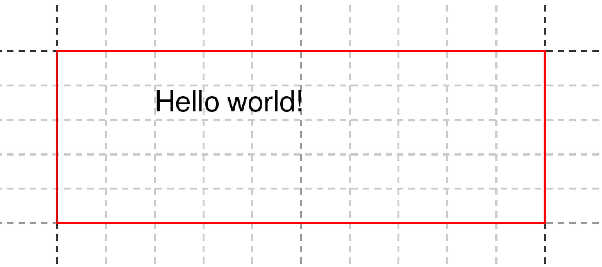
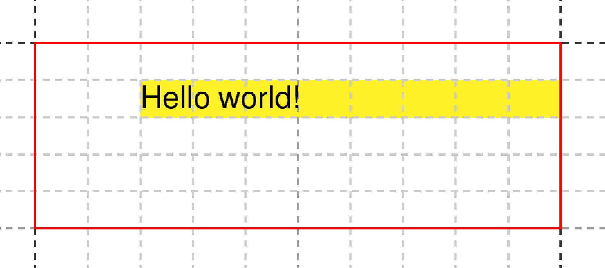
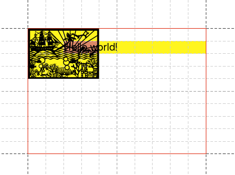
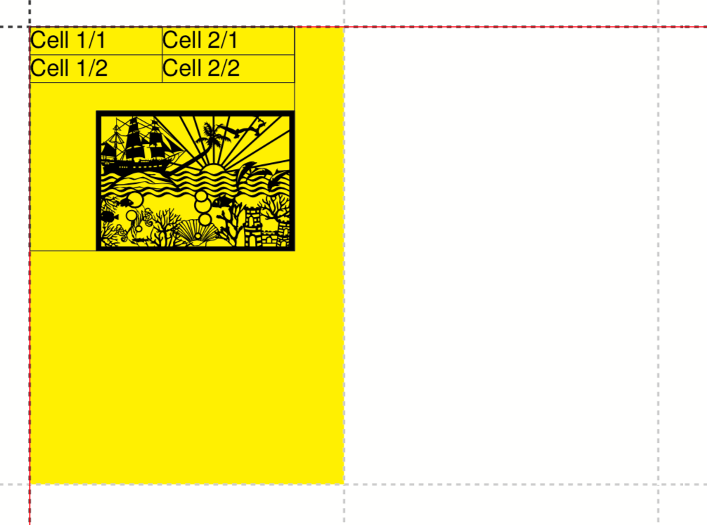

# Grid

The grid is a set of invisible lines or boxes to which objects are aligned. It is familiar from newspaper printing, for example, where there are often five or six columns. All pictures or advertisements then fill one or more columns. Likewise, there are often grid lines in catalogues that work in a similar way. In this way a clear layout is achieved.

XTS always works with such a grid. Since every publication is different, there is no way to find a sensible default for it. By default the grid is set to a size of 1cm × 1cm. It applies to the page as well as all positioning frames and groups. You can display the grid with `xts --trace grid` or `<Trace grid="yes"/>` in the layout.

~~~xml
<Layout xmlns="urn:speedata.de/2021/xts/en"
  xmlns:sd="urn:speedata.de/2021/xtsfunctions/en">

  <SetGrid height="12pt" nx="10"/>
  <Trace grid="yes"/>
  <Pageformat width="8cm" height="4cm"/>

  <Record element="data">
    <PlaceObject column="3" row="2">
      <Textblock>
        <Paragraph>
          <Value>Hello world!</Value>
        </Paragraph>
      </Textblock>
    </PlaceObject>
  </Record>

</Layout>
~~~

results in

<figure markdown>
  { width="66.6%" }
  <figcaption>Simple grid</figcaption>
</figure>

If you look closely, you will see that the first and then every fifth stroke is drawn a little darker. This helps to count grid cells if necessary. The red line shows the border of the page, in the default setting the borders are 1cm each.

## Positioning objects in the grid

In the example above, you can see that the entries for row and column refer to the grid, the origin in the upper left corner has the coordinate 1,1. Besides the placement in grid coordinates, there is also the absolute placement: here, the object can always be positioned exactly at a certain position in the PDF. This is suitable, for example, for logos or background images that are to be displayed at a fixed position. These two variants cannot be combined within one output with `<PlaceObject>`: you have to choose one of the two variants.


<figure markdown>
```xml
<!-- grid -->
<PlaceObject row="4" column="5">
    <Image file="_samplea.pdf" width="5"/>
</PlaceObject>
<!-- absolute -->
<PlaceObject row="12mm" column="5cm">
    <Image file="_samplea.pdf" width="5"/>
</PlaceObject>
```
  <figcaption>Grid-based output (top) and absolute output (bottom). For grid-based output, the specifications are coordinates in the page grid, where the upper left corner is position 1,1. For absolute positioning, the specification is measured from the upper left corner. As soon as one of the two specifications is a length specification, the absolute positioning is taken.</figcaption>
</figure>


The line and column specifications always refer to the upper left-hand corner of the object, unless you specify with `hreference` or `vreference` that the specification should refer to the lower or right-hand corner.
The objects align themselves to the upper and left edge of the first grid cell. Using halign and valign you can also align the object to the right or bottom:


~~~xml
<PlaceObject column="{sd:number-of-columns()}" row="1"
    hreference="right">
  <Image file="logo.pdf" width="2.5"/>
</PlaceObject>

<PlaceObject column="{sd:number-of-columns()}" row="4"
    hreference="right" halign="right">
  <Image file="logo.pdf" width="2.5"/>
</PlaceObject>
~~~

<figure markdown="1">
  { width="100%" }
  <figcaption>By specifying <code>hreference="right"</code>, the column specification is not used for the left edge of the image, but for the right edge. If the width of the image does not correspond to a multiple of the raster width, as in this example, the alignment within the raster cell must also be corrected with <code>halign="right"</code> (right logo).</figcaption>
</figure>


## Defining the grid

The grid is set globally with the command `<SetGrid>`. For example:

~~~xml
<SetGrid height="12pt" width="5mm"/>
~~~

sets the grid height to 12 points and the width to 5 millimeters.
In addition to the fixed values, there is also the possibility to set the number of grid cells horizontally and vertically:

~~~xml
<SetGrid nx="9" ny="9" />
~~~

This creates a so-called nine-division, which is often used in book design. It is also possible to define distances between the grid cells, as is common in newspaper typesetting, for example:

~~~xml
<SetGrid width="45mm" dx="3mm" height="12pt" />
~~~

If the grid does not fit completely into the type area, e.g. with a grid width of 3 centimeters and a page width of 10 centimeters, this leads to a conflict in the page layout. This causes the right or bottom margin to be shifted and does not match the values specified in the page type.

## What is the grid needed for?

If you call `xts` with the `xts --trace gridallocation` option, you can see immediately what the grid is for. Occupied cells are marked internally, so that no other object can be placed in this area.
At least not without an error message or the hint that no area should be kept free for it (`allocate="no"` in `<PlaceObject>`).

~~~xml
<Layout xmlns="urn:speedata.de/2021/xts/en"
  xmlns:sd="urn:speedata.de/2021/xtsfunctions/en">

  <SetGrid height="12pt" nx="10"/>
  <Trace grid="yes" gridallocation="yes"/>
  <Pageformat width="8cm" height="4cm"/>

  <Record element="data">
    <PlaceObject column="3" row="2">
      <Textblock>
        <Paragraph>
          <Value>Hello world!</Value>
        </Paragraph>
      </Textblock>
    </PlaceObject>
  </Record>

</Layout>
~~~

<figure markdown>
  { width="100%" }
  <figcaption>Grid with grid allocation display switched on. The yellow area is internally marked as “allocated”.</figcaption>
</figure>


Attempting to place an object in an already occupied area gives a warning.

If you add the lines

~~~xml
<PlaceObject column="1" row="1">
  <Image file="ocean.pdf" height="4"/>
</PlaceObject>
~~~

the following grid assignment results:

<figure markdown>
  { width="100%" }
  <figcaption>Double occupied grid. Areas that share (overlap) several objects are marked red.</figcaption>
</figure>


and a warning:

FIXME: NYI

~~~
...
PlaceObject: Image in row 1 and column 1, width=4, height=4 (page 1)
Warning: Conflict in grid
...
~~~

If you omit the specifications for column and row, XTS will automatically look for the next free position.

~~~xml
<Layout
  xmlns="urn:speedata.de/2021/xts/en"
  xmlns:sd="urn:speedata.de/2021/xtsfunctions/en">

  <Trace grid="yes"/>

  <Record element="data">
    <PlaceObject>
      <Image width="4" href="_samplea.pdf"/>
    </PlaceObject>
    <PlaceObject>
      <Image width="4" href="_sampleb.pdf"/>
    </PlaceObject>
  </Record>
</Layout>
~~~

<figure markdown>
  { width="100%" }
  <figcaption>Objects automatically search for the next free space, unless otherwise specified.</figcaption>
</figure>

<!--
FIXME

TIP: Absolutely placed objects do not occupy areas in the grid by default. In this case `allocate="no"` is set. With `allocate="yes"` the behaviour can be set to the same as for objects placed in the grid. -->


## Separate grids in groups

The following is an example of a grid within a group that differs from the global grid.
Without the explicit `<Grid ... />` specification, the grid is taken from the page.

<figure markdown>
~~~xml
<Layout xmlns="urn:speedata.de/2021/xts/en"
  xmlns:sd="urn:speedata.de/2021/xtsfunctions/en">

  <SetGrid nx="4" ny="4"/>
  <Trace grid="yes" gridallocation="yes" objects="yes"/>

  <Record element="data">
    <Group name="table">
      <Grid width="1cm" height="12pt"/>
      <Contents>
        <PlaceObject>
          <Table width="4" stretch="max">
            <Tr>
              <Td><Paragraph><Value>Cell 1/1</Value></Paragraph></Td>
              <Td><Paragraph><Value>Cell 2/1</Value></Paragraph></Td>
            </Tr>
            <Tr>
              <Td><Paragraph><Value>Cell 1/2</Value></Paragraph></Td>
              <Td><Paragraph><Value>Cell 2/2</Value></Paragraph></Td>
            </Tr>
          </Table>
        </PlaceObject>
        <PlaceObject row="4" column="2">
          <Image file="ocean.pdf" width="3"/>
        </PlaceObject>
      </Contents>
    </Group>

    <PlaceObject groupname="table"/>
  </Record>
</Layout>
~~~
  <figcaption>The group has its own grid that is independent of the page grid.</figcaption>
</figure>

<figure markdown>
  { width="100%" }
  <figcaption>Section of a page. The grid within the group is much finer than the coarse page grid.</figcaption>
</figure>
