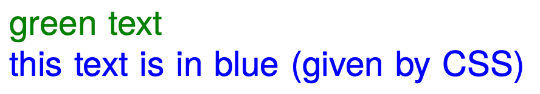
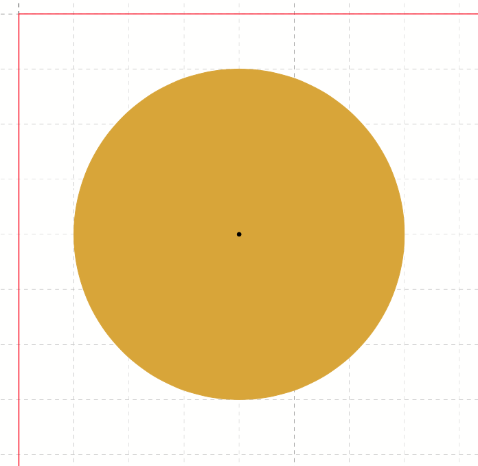

# Outputting objects

The command to place objects on a page is called `<PlaceObject>`.

The parameters are listed in detail in the [command reference](../reference/cmdreference/placeobject.md). Here are some examples and possible applications.

In the simplest case, the command can be used as follows:

~~~xml
<Record element="data">
  <PlaceObject>
    <Image href="_samplea.pdf" width="5"/>
  </PlaceObject>
</Record>
~~~

Here an image is loaded with the specified file name and a specified width. The image `_samplea.pdf` (with underscore at the beginning) is included in the distribution and can be used as a placeholder.

## Grid based placement of objects

The [section about grids](grid.md) provides a detailed description of the design grid.
Only so much should be mentioned here: The grid helps on the one hand to position the objects (easy arrangement of the objects) and on the other hand to find the right place. Grid cells are not occupied by two objects at the same time, unless you explicitly allow this.

This is an example of grid-based output. The specifications for `row` and `column` are coordinates in the page grid, where the upper left corner is position 1,1.

~~~xml
<PlaceObject row="4" column="5">
    <Image href="_samplea.pdf" width="5"/>
</PlaceObject>
~~~

## Order of the objects

The order in which the individual objects are output is important: the objects are drawn on top of each other. This means that objects that are output later overlap the previous objects. This can be useful for background images. In `<AtPageCreation>` you can output a stationery or page header, which is then overwritten with real content in the actual data processing. Or you can include a ready-made page and provide it with the correct page number:

~~~xml
<Layout xmlns="urn:speedata.de/2021/xts/en"
  xmlns:sd="urn:speedata.de/2021/xtsfunctions/en">

  <Record element="data">
    <PlaceObject row="1" column="1">
      <Image file="termsofservice.pdf" width="180mm" height="280mm"/>
    </PlaceObject>
    <PlaceObject column="1" row="{sd:number-of-rows()}">
      <Textblock>
        <Paragraph>
          <Value select="sd:current-page()"/>
        </Paragraph>
      </Textblock>
    </PlaceObject>
  </Record>
</Layout>
~~~

Here the page is first integrated and then the current page number is "printed" right-justified in the last line.

## Height and width of the objects

Images, barcodes, boxes etc. have fixed widths and heights. Texts and tables use the available width.
That is, the width is the difference between the number of grid cells and the start column plus 1. For an example width of 15 grid boxes and a start column of 6, the text width is 10, unless otherwise specified.

If an object (such as images) requires a width or height specification, this can be given either as an absolute value (e.g. 5cm) or in grid cells.

## Text block
This is a rectangular text area that is not wrapped over multiple pages. Text blocks are ideal for page numbers, short descriptions, column titles and all other units where page breaks are not desired.

A block of text can contain one or more paragraphs.

~~~xml
<Textblock>
  <Paragraph style="color: green">
    <Value>green text</Value>
  </Paragraph>
  <Paragraph>
    <Value>this text is in blue (given by CSS)</Value>
  </Paragraph>
</Textblock>
~~~

Further formatting options are described in the [section about fonts](fonts.md).

<figure markdown>
  { width="300" }
  <figcaption>Specifications in the paragraphs overwrite the values in the text block</figcaption>
</figure>

The complete description of `<Textblock>` can be found in the reference ([section Textblock](../reference/cmdreference/textblock.md)).

## Introduction to tables

The table model used in XTS corresponds approximately to the model known from HTML.
The rows are specified with `<Tr>` and the individual columns with `<Td>`.

The structure of a simple table without column declaration, header and footer looks as follows:

~~~xml
<PlaceObject>
  <Table>
    <Tr>
      <Td>...</Td>
      <Td>...</Td>
    </Tr>
    <Tr>
      <Td>...</Td>
      <Td>...</Td>
    </Tr>
  </Table>
</PlaceObject>
~~~

The contents of the table cells can be paragraphs, pictures and other objects.

~~~xml
<Td>
  <Paragraph>
    <Value>...</Value>
  </Paragraph>
</Td>

<Td>
  <Image file="ocean.pdf" width="4"/>
</Td>
~~~

A practical feature of tables is that they can run over several pages, even with repeating headers and footers.
The table cells can contain text, images, barcodes, etc.; in other words, anything that can also be contained in `<PlaceObject>'.
Individual cells are never wrapped to multiple pages, i.e. they are set as a rectangular box, even if the contents would allow wrapping (e.g. texts or tables).

A separate chapter is devoted to the topic of tables (TBD).

## Images

Including images is, as already shown at the beginning, very easy. The command for this is `<Image>':

~~~xml
<PlaceObject>
    <Image file="_samplea.pdf" width="5cm"/>
</PlaceObject>
~~~

Images can be in the formats PDF, JPEG and PNG and can be integrated. All other formats such as Tiff or SVG must be converted first.

The command for embedding images is very powerful and is described in detail in a separate section (TBD). The [reference](../reference/cmdreference/image.md)  contains a short description of all possibilities.

## Rectangular areas (`<Box>`)

Rectangular surfaces are created with the command `<Box>`.

~~~xml
<PlaceObject>
  <Box width="4" height="3" backgroundcolor="limegreen"/>
</PlaceObject>
~~~

<figure markdown>
  { width="300" }
  <figcaption>A colored box, output with <code>&lt;Box></code></figcaption>
</figure>

Boxes are often used for colored areas behind a text or table.
In this case the allocation of the raster cells must be switched off (`allocate="no"` at `<PlaceObject>`), otherwise a warning will be issued because of the double allocation of the area in the PDF (see section [grid](grid.md)).
An example for the use of boxes as background can be found in the section about grip marks.
There, the parameter bleed is also explained, which is used to enlarge the box in one or more directions, if they are located at the page margin.

## Circle

Circles are output with the command `<Circle>`:

~~~xml
<Record element="data">
  <PlaceObject column="5" row="5">
    <Circle radiusx="3" backgroundcolor="goldenrod"/>
  </PlaceObject>
  <PlaceObject column="5" row="5">
    <Circle radiusx="1pt" backgroundcolor="black"/>
  </PlaceObject>
</Record>
~~~

In this example the radius of the large circle is 3 grid boxes and the center of the circle is in the upper left corner of the box (5.5). So it starts in the second column and the second row and extends to the seventh column and row. Circles have the special property that no grid cells are marked as allocated.

<figure markdown>
  { width="300" }
  <figcaption>Circle with radius 3 and center at (5,5)</figcaption>
</figure>

<!--
## Rules

There are horizontal and vertical rules. These can have a thickness, a color and a length. Rules can be solid and dashed:

~~~xml
<PlaceObject column="2" row="2">
  <Rule direction="horizontal" length="4" dashed="yes"/>
</PlaceObject>
~~~

Rules are always aligned in the upper left corner of the box.

[[abb-gestricheltelinie]]
.A dashed rule.
image::gestricheltelinie.png[width=80%]

[[ch-outputtingobjects-frame]]
## Frame

The frame (like the transformation below) is a special object that you place over another object. A frame (`<Frame>`) always contains another object, for example a picture.

~~~xml
<PlaceObject>
  <Frame
    border-bottom-left-radius="8pt"
    border-bottom-right-radius="8pt"
    border-top-left-radius="8pt"
    border-top-right-radius="8pt"
    framecolor="darkseagreen"
    rulewidth="2pt">
    <Image file="_samplea.pdf" width="4"/>
  </Frame>
</PlaceObject>
~~~

You can see that the frame works as a clipping path, the parts outside are hidden. You can also set the rulewidth to zero and make it invisible, then only the content will be clipped.

[[abb-eagleframe]]
.Frame with radius 8pt and line width of 2 points.
image::eagle-frame.png[width=50%]

[[ch-outputtingobjects-transformation]]
## Transformation

[[abb-transformationen]]
.The four basic transformations (from the PDF specification)
image::transformation.png[width=100%]

Like the frame, the transformation is an enclosing element. This means that the element must still have a content, such as an image.

In the transformation, you specify a matrix consisting of six numbers in the form "a b c d e f". The transformation from one coordinate system to another is mapped using the following 3x3 matrix:

image::formel1.png[width=50%]

If you want to calculate the new coordinates x' and y' from the coordinates x and y, you can also do this using the following formulas:

image::formel2.png[width=30%]

There are the following basic transformation types (see figure The four basic transformations (from the PDF specification))

. Displacements (translation) are described with the values 1 0 0 1 t~x~ t~y~ . Scaling is specified with s~x~ 0 0 0 s~y~ 0 0 0
. Rotation can be achieved with cos θ sin θ -sin θ cos θ 0 0
. Displacements (skew) are described with 1 tan α tan β 1 0 0
. The unchanging transformation is 1 0 0 1 0 0 (identical figure).

~~~xml
<PlaceObject>
  <Transformation matrix="1.8 0.2 0.2 0.8 0 0 ">
    <Image file="ocean.pdf" width="4"/>
  </Transformation>
</PlaceObject>
~~~

[[abb-eagletransformation]]
.Shifting and scaling by the transformation matrix.
image::eagle-transform.png[width=50%,scaledwidth=100%]
//~

[.profeature]
[[ch-barcodes]]
-->

## Barcodes, QR Codes

Barcodes or QR codes are integrated via the command [`<Barcode>`](../reference/cmdreference/barcode.md):

~~~xml
<PlaceObject>
  <Barcode select="'Hello world'" type="QRCode" width="5"/>
</PlaceObject>
~~~

The output is as expected

<figure markdown>
  { width="300" }
  <figcaption>Hello world in pixels</figcaption>
</figure>

Barcodes in the coding "EAN13" and "Code 128" can be output.

<!--
## Clipping

Since version 4.11.3 the speedata Publisher can clip any kind of objects. The new object is smaller than the original object if the method is clip (`method=clip`, the default) is selected, otherwise (`method=frame`) the resulting object has the original size but the visible portion of the image is set to the clipping path.

A user came up with a very good description of the differences between the methods `clip` and `frame`:

If _Publisher_ had scissors, “clip” would cut the image itself, while “frame” would cut a frame to be placed on top of the image (enabling partial display).

~~~xml
<Layout xmlns="urn:speedata.de/2021/xts/en"
  xmlns:sd="urn:speedata.de/2021/xtsfunctions/en">
  <Pageformat height="14cm" width="11cm" />

  <Record element="data">
    <PlaceObject>
      <Clip left="1cm" right="1cm" top="1cm" bottom="2cm" method="clip">
        <Image width="5cm" file="_sampleb.pdf" />
      </Clip>
    </PlaceObject>
    <PlaceObject column="5" >
      <Image width="5cm" file="_sampleb.pdf" />
    </PlaceObject>
  </Record>
</Layout>
~~~

[[fig-clippedobject]]
.A clipped and a non-clipped image.
image::outputobjects-clip.png[width=100%]

// EOF
-->