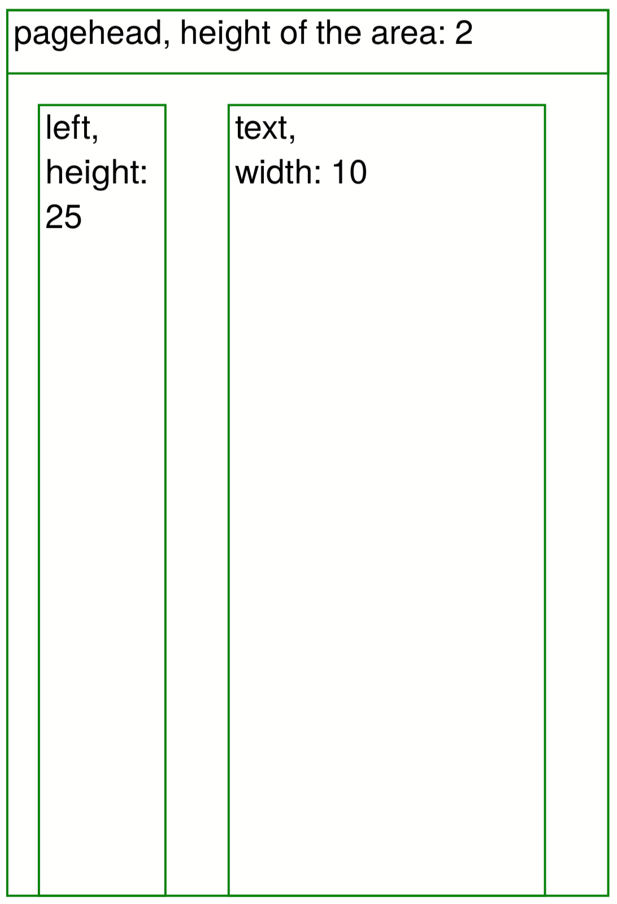
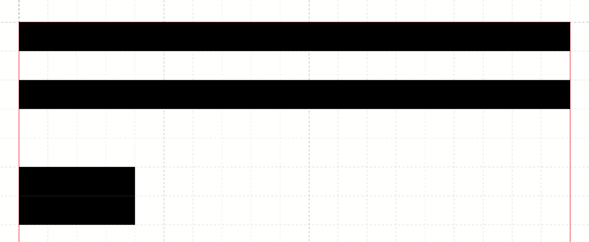

# Areas on the page (PositioningArea)

The pages can be divided into virtual areas. To do this, you specify frames in the page type:

~~~xml
<Pagetype name="page" test="true()" margin="1cm">
  <PositioningArea name="pagehead">
    <PositioningFrame width="19" height="2" row="1" column="1"/>
  </PositioningArea>
  <PositioningArea name="left">
    <PositioningFrame
        width="4"
        height="{sd:number-of-rows() - 3}"
        row="4"
        column="2"/>
  </PositioningArea>
  <PositioningArea name="text">
    <PositioningFrame
        width="10"
        height="{sd:number-of-rows() - 3}"
        row="4"
        column="8"/>
  </PositioningArea>
</Pagetype>
~~~

Three areas are defined here, which can be addressed with the attribute `area="..."` when it comes to the output of objects or the movement of the cursor:

FIXME: number of rows implemented?

~~~xml
<Record element="data">
  <PlaceObject area="pagehead">
    <Textblock>
      <Paragraph>
        <Value>pagehead, height of the area: </Value>
        <Value select="sd:number-of-rows('pagehead')" />
      </Paragraph>
    </Textblock>
  </PlaceObject>
  <PlaceObject area="left">
    <Textblock>
      <Paragraph>
        <Value>left, height: </Value>
        <Value select="sd:number-of-rows('left')" />
      </Paragraph>
    </Textblock>
  </PlaceObject>
  <PlaceObject area="text">
    <Textblock>
      <Paragraph>
        <Value>text, width: </Value>
        <Value select="sd:number-of-columns('text')" />
      </Paragraph>
    </Textblock>
  </PlaceObject>
</Record>
~~~

<figure markdown>
  { width="66.6%" }
  <figcaption>The areas of the page are addressed with area="...". Some layout functions allow you to specify an area.</figcaption>
</figure>

## Cursor

The cursor is a virtual marker that is moved in the grid after each output, unless it is explicitly prohibited (`keepposition="yes"` at `<PlaceObject>`).
The selection is controlled separately for each area.
I.e. an output in one area does not result in a change of the cursor in another area.
If an object is output that extends to the right margin, the cursor automatically jumps to the next free line. The cursor can be moved line by line with `<NextRow>`. If you specify `rows="n"`, the cursor is placed n rows lower. If you specify `row="n"`, the cursor is placed in row `n`.

The following example illustrates the behavior of the cursor.

~~~xml
<Layout
  xmlns="urn:speedata.de/2021/xts/en"
  xmlns:sd="urn:speedata.de/2021/xtsfunctions/en">

  <Trace grid="yes"/>

  <Record element="data">
    ①
    <PlaceObject>
      <Box width="{sd:number-of-columns()}" height="1"/>
    </PlaceObject>
    <NextRow rows="1" />
    <PlaceObject>
      <Box width="{sd:number-of-columns()}" height="1"/>
    </PlaceObject>

    <NextRow rows="2" />

    <PlaceObject>
      <Box width="4" height="1"/>
    </PlaceObject>
    ②
    <NextRow rows="1" />
    <PlaceObject>
      <Box width="4" height="1"/>
    </PlaceObject>

  </Record>
</Layout>
~~~
① The two objects cover the entire width. The cursor automatically jumps to the next line as soon as it is behind the right edge. The `<NextRow>` creates the free row. 
② The cursor is now in row 6 and column 5. The following row feed sets the cursor in row 7 and column 1.

<figure markdown>
  { width="100%" }
  <figcaption>The behavior of NextRow</figcaption>
</figure>

<!--
## Overflow of texts into the next frame

When outputting texts using the commands `<Output>`/`<Text>`, page breaks can occur in texts, as described in the section <<ch-outputobjects-output>>. This works not only for page boundaries, but also for areas on the pages, provided that they have the same name.

This page definition serves as an example:

~~~xml
  <Pagetype name="page" test="true()">
    <Margin left="1cm" right="1cm" top="1cm" bottom="1cm"/>
    <PositioningArea name="text">
      <PositioningFrame width="4" height="17" row="2" column="1"/>
      <PositioningFrame width="4" height="10" row="3" column="6"/>
      <PositioningFrame width="4" height="24" row="1" column="11"/>
    </PositioningArea>
  </Pagetype>
~~~

The output is generated via `<Output>`:

~~~xml
    <Output area="text">
      <Text>
        <Paragraph>
          <Value select="sd:dummytext(3)"/>
        </Paragraph>
      </Text>
    </Output>
~~~

.The text automatically flows into the next free area. If necessary, a page break is inserted.
image::textoverflow.png[width=100%]
-->

## Force a frame switch

You can also force a frame to change. With `<NextFrame>` and the specification of an area (`area="..."`) the cursor is placed in the top left corner of the next frame, if necessary a page break is inserted.
