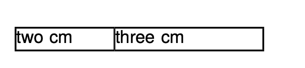

# Function definitions

You can define your own functions in the layout file. The following example defines a function called `add` which takes two arguments and calls it in the `<Message>` command:

~~~xml title="layout.xml"
<Layout xmlns="urn:speedata.de/2021/xts/en"
    xmlns:sd="urn:speedata.de/2021/xtsfunctions/en"
    xmlns:fn="mynamespace">

    <Record element="data">
        <Message select=" fn:add(4,3) "/>
    </Record>

    <Function name="fn:add">
        <Param name="first" />
        <Param name="second" />
        <Value select="$first + $second " />
    </Function>
</Layout>
~~~

The output in the protocol file is

```
info	Message (line 7): 7.000000
```

which is what we should expect.

There are a few things to mention:

* The namespace of the function must be defined in the root element.
* You can output objects in a function definition.
* Variables have a local scope.
* Every command that has a return value contributes to the output of the function:

    The following function definition returns a sequence of two values:

    ```xml
    <Function name="fn:mult-and-add">
        <Param name="first" />
        <Param name="second" />
        <Value select="$first * $second "></Value>
        <Value select="$first + $second "></Value>
    </Function>
    ```


## A more complex example

=== "`layout.xml`"
    ~~~xml
    <Layout xmlns="urn:speedata.de/2021/xts/en"
        xmlns:sd="urn:speedata.de/2021/xtsfunctions/en"
        xmlns:fn="mynamespace">

        <Stylesheet scope="layout"> Td { border: 1pt solid black; } </Stylesheet>
        <Record element="data">
            <PlaceObject>
                <Table>
                    <!-- this is one argument (a sequence with two items) -->
                    <Value select="fn:cols(('2cm','3cm'))" />
                    <Tr>
                        <Td>
                            <Paragraph><Value>two cm</Value></Paragraph>
                        </Td>
                        <Td>
                            <Paragraph><Value>three cm</Value></Paragraph>
                        </Td>
                    </Tr>
                </Table>
            </PlaceObject>
        </Record>

        <Function name="fn:cols">
            <Param name="colspec" />
            <Columns>
                <ForAll select="$colspec">
                    <Column width="{.}" />
                </ForAll>
            </Columns>
        </Function>
    </Layout>
    ~~~
=== "`data.xml`"
    ```xml
    <data>
    </data>
    ```
=== "`result`"
    {: style="height:150px; border: 1px solid black;"}


Here the function `fn:cols` is defined with one parameter. This function is called with one argument: a sequence of two strings. This sequence is stored in the variable `colspec`. The `<ForAll>` loop iterates over this sequence and builds the following XML elements:

```xml
<Columns>
    <Column width="2cm" />
    <Column width="3cm" />
</Columns>
```

The curly braces jump into XPath mode and take the current item as an argument. In each iteration of the `<ForAll>` loop, the current item is set to each value of the sequence.
