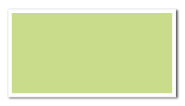

# Box


Create a rectangular colored area. The area must fit the grid cells.


##  Child elements

(none)

##  Parent elements

[PlaceObject](../placeobject.md), [Td](../td.md)


## Attributes


`backgroundcolor` (text, optional, "CSS property": background-color)
:   Color of the box. If the color name is a dash (`-`), a transparent background is used.


`class` (text, optional)
:   CSS class for this element.


`height` (number or length)
:   Height of the box in grid cells.


`id` (text, optional)
:   CSS id for this element.


`width` (number or length)
:   Width of the box in grid cells or in absolute values.


## Example

```xml
<DefineColor name="mygreen" model="cmyk" c="22" m="0" y="55" k="0"/>
<PlaceObject>
  <Box width="10" height="5" backgroundcolor="mygreen"/>
</PlaceObject>

```

looks like


{: style="width=auto"; }


