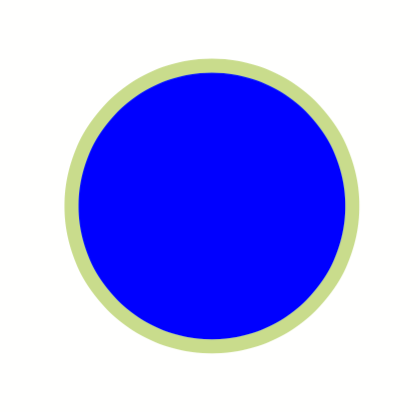

# Circle


Create a circle or ellipse.


##  Child elements

(none)

##  Parent elements

[PlaceObject](../placeobject.md)


## Attributes


`background-color` (text, optional, "CSS property": background-color)
:   Color of the circle.


`border-color` (text, optional, "CSS property": color)
:   Color of the circle line.


`border-width` (length, optional)
:   The thickness of the border that is drawn around the object.


`class` (text, optional)
:   CSS class for the circle.


`id` (text, optional)
:   CSS id for this circle.


`origin-x` (0 up to 100, optional)
:   Determines the horizontal area where the coordinates from [PlaceObject](../placeobject.md) are located. Value is from 0 (left edge) to 100 (right edge), with a default of 50 (horizontally centered).


`origin-y` (0 up to 100, optional)
:   Determines the vertical area where the coordinates from [PlaceObject](../placeobject.md) are located. Value is from 0 (top edge) to 100 (bottom edge), with a default of 50 (verically centered).


`radius-x` (number or length)
:   Radius of the circle in grid cells (horizontal) or as an absolute length. Use with `radius-y` to create an ellipse.


`radius-y` (number or length, optional)
:   Radius of the ellipse in grid cells (vertical) or as an absolute length.


## Example

```xml
<DefineColor name="mygreen" model="cmyk" c="22" m="0" y="55" k="0"/>
<PlaceObject row="5" column="5" >
    <Circle radius-x="10mm" background-color="blue" border-color="mygreen" border-width="1mm"/>
</PlaceObject>

```

looks like


{: style="width=auto"; }


