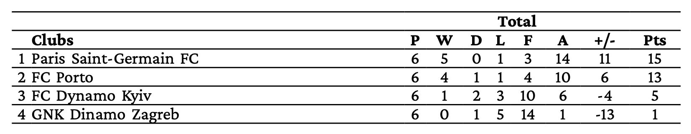

# Table


Create a table that is similar to the HTML table model.


##  Child elements

[Columns](../columns.md), [ForAll](../forall.md), [Loop](../loop.md), [Tablehead](../tablehead.md), [Tr](../tr.md), [Value](../value.md)

##  Parent elements

[PlaceObject](../placeobject.md), [SetVariable](../setvariable.md), [Td](../td.md)


## Attributes


`width` (number or length, optional)
:   The maximum width of the table (in grid cells or absolute values). Defaults to the available space.


## Remarks
The table cells may contain Paragraphs, Images and other objects that are allowed in [PlaceObject](../placeobject.md).


## Example

```xml

<Stylesheet>
    table {
        font-family: serif;
        font-size: 14pt;
        width: 100%;
    }
    td {
        border-top: 0.5 solid black;
        border-bottom: 0.5 solid black;
        text-align: center;
    }
    thead {
        font-weight: bold ;
    }
    .left { text-align: left ; }
</Stylesheet>
<Record element="data">
    <PlaceObject>
        <Table>
            <Tablehead>
                <Tr>
                    <Td colspan="2"/>
                    <Td colspan="7">
                      <Paragraph><Value>Total</Value></Paragraph></Td>
                    <Td/>
                </Tr>
                <Tr>
                    <Td/>
                    <Td class="left"><Paragraph><Value>Clubs</Value></Paragraph></Td>
                    <Td><Paragraph><Value>P</Value></Paragraph></Td>
                    <Td><Paragraph><Value>W</Value></Paragraph></Td>
                    <Td><Paragraph><Value>D</Value></Paragraph></Td>
                    <Td><Paragraph><Value>L</Value></Paragraph></Td>
                    <Td><Paragraph><Value>F</Value></Paragraph></Td>
                    <Td><Paragraph><Value>A</Value></Paragraph></Td>
                    <Td><Paragraph><Value>+/-</Value></Paragraph></Td>
                    <Td><Paragraph><Value>Pts</Value></Paragraph></Td>
                </Tr>
            </Tablehead>
            <ForAll select="entry">
                <Tr>
                    <Td><Paragraph><Value select="@pos"/></Paragraph></Td>
                    <Td class="left"><Paragraph><Value select="@name"/></Paragraph></Td>
                    <Td><Paragraph><Value select="@p"/></Paragraph></Td>
                    <Td><Paragraph><Value select="@tw"/></Paragraph></Td>
                    <Td><Paragraph><Value select="@td"/></Paragraph></Td>
                    <Td><Paragraph><Value select="@tl"/></Paragraph></Td>
                    <Td><Paragraph><Value select="@ta"/></Paragraph></Td>
                    <Td><Paragraph><Value select="@tf"/></Paragraph></Td>
                    <Td><Paragraph><Value select="@tpm"/></Paragraph></Td>
                    <Td><Paragraph><Value select="@pts"/></Paragraph></Td>
                </Tr>
            </ForAll>
        </Table>
    </PlaceObject>
</Record>

```

Using the following data:


```xml
<data>
  <entry pos="1" name="Paris Saint-Germain FC" p="6"
  	  tw="5" td="0" tl="1" tf="14" ta="3" tpm="11" pts="15" />
  <entry pos="2" name="FC Porto" p="6"
  	  tw="4" td="1" tl="1" tf="10" ta="4" tpm="6" pts="13" />
  <entry pos="3" name="FC Dynamo Kyiv" p="6"
  	  tw="1" td="2" tl="3" tf="6"  ta="10" tpm="-4" pts="5" />
  <entry pos="4" name="GNK Dinamo Zagreb" p="6"
  	  tw="0" td="1" tl="5" tf="1"  ta="14" tpm="-13" pts="1" />
</data>
```

{: style="width=auto"; }


